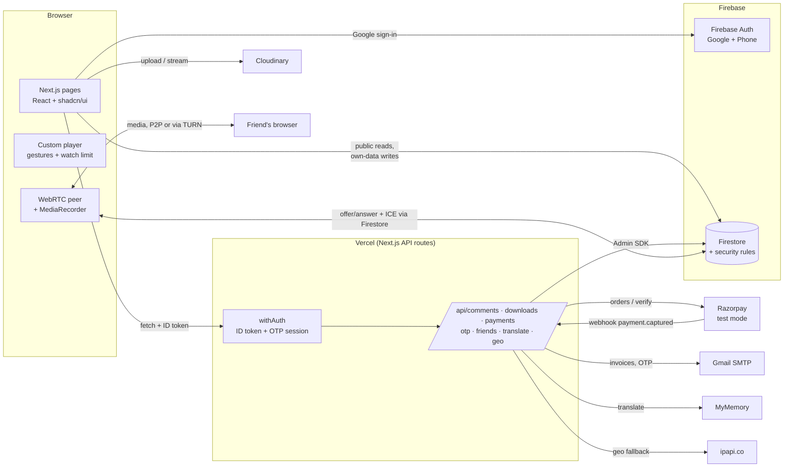

# YourTube

A YouTube-style video app built with **Next.js 15 (Pages Router), React 19, TypeScript, Tailwind v4 and shadcn/ui**, backed by **Firebase** (Auth + Firestore), **Cloudinary** (video storage), **Razorpay** (test-mode payments) and deployed on **Vercel**.

**Live:** https://yourtube-nu.vercel.app · **Detailed guide:** [docs/PROJECT_GUIDE.md](docs/PROJECT_GUIDE.md)

## Features

| Area | What it does |
|---|---|
| **Comments** | City shown next to each commenter (resolved on the server) · like/dislike (mutually exclusive, toggle off, not on your own) · a comment is **removed at 2 dislikes** (in a Firestore transaction) · special characters blocked (any language's letters, digits and basic punctuation allowed) · **Translate** into 15 languages via MyMemory, with "Show original" |
| **Downloads** | Download button on every video · **Free: 1 per day** (resets at midnight IST) · **Premium (₹99)**: unlimited · `/downloads` page lists what you've downloaded |
| **Plans** | Free 5 min · Bronze ₹10 7 min · Silver ₹50 10 min · Gold ₹100 unlimited watch time **per video** · upgrade-only `/plans` page · player locks with an upgrade overlay at the limit |
| **Invoices** | Email with HTML + **PDF invoice** after every purchase (invoice number, IST time, plan, amount, Razorpay IDs, "Test mode") · "Resend invoice" if the email failed |
| **Theme** | **Light only 10:00–12:00 IST in Tamil Nadu, Kerala, Karnataka, Andhra Pradesh, Telangana**; dark everywhere else · re-checked every minute |
| **OTP sign-in step** | After Google sign-in: code by **email** in the 5 southern states, by **SMS** (Firebase Phone Auth) elsewhere · 5-minute expiry, 5 attempts, 1 send per 30 s / 5 per hour · nothing protected works until it passes |
| **Player** | Custom controls (play, seek, volume, speed, fullscreen) · tap gestures: sides ×2 = ∓10 s, centre ×1 = play/pause, centre ×3 = next video, left ×3 = comments, right ×3 = close · keyboard Space/K, J/L, F |
| **Calls** | Friends by email (request → accept) with online status · peer-to-peer **video calls** (WebRTC, Firestore signalling, TURN) · **screen share** ("pick the YouTube tab to watch together") · **record** the call to your device, with a REC indicator for both people |

## Architecture



**Anything that controls money or limits runs on the server.** That covers plans, Premium, download quota, dislike removal, the special-character rule, payment verification and the OTP. `firestore.rules` stops browsers writing those fields directly. Prices come only from [`yourtube/src/lib/plans.ts`](yourtube/src/lib/plans.ts); the browser just sends a product id.

**Location** comes from Vercel's `x-vercel-ip-*` headers, with `ipapi.co` as the fallback for local dev. **Every time rule uses IST** (`Asia/Kolkata`), never the browser's time zone.

## Local setup

Requirements: Node ≥ 22, Java (for the Firebase emulators, tests only).

```bash
cd yourtube
npm install
cp .env.example .env.local   # fill it in; every variable is explained there
npm run dev                   # http://localhost:3000
```

Deploy Firestore rules and indexes (from the repo root):

```bash
npx --prefix yourtube firebase deploy --only firestore
```

### Environment variables

All of them are listed and explained in [`yourtube/.env.example`](yourtube/.env.example). In summary:

| Group | Variables | Secret? |
|---|---|---|
| Firebase web | `NEXT_PUBLIC_FIREBASE_*` (in production `…_AUTH_DOMAIN` = the Vercel domain) | no |
| Firebase Admin | `FIREBASE_PROJECT_ID`, `FIREBASE_CLIENT_EMAIL`, `FIREBASE_PRIVATE_KEY` | **yes** |
| Cloudinary | `NEXT_PUBLIC_CLOUDINARY_CLOUD_NAME`, `NEXT_PUBLIC_CLOUDINARY_UPLOAD_PRESET` (unsigned) | no |
| Razorpay | `RAZORPAY_KEY_ID`, `RAZORPAY_KEY_SECRET`, `RAZORPAY_WEBHOOK_SECRET` (`NEXT_PUBLIC_RAZORPAY_KEY_ID` optional) | **yes** (secrets) |
| Email | `SMTP_USER`, `SMTP_PASS` (Gmail App Password), `MAIL_FROM` | **yes** (`SMTP_PASS`) |
| Translation | `MYMEMORY_EMAIL` (optional, raises quota) | no |
| Calls | `NEXT_PUBLIC_TURN_URL`, `NEXT_PUBLIC_TURN_USERNAME`, `NEXT_PUBLIC_TURN_CREDENTIAL` | public by design |
| Demo | `NEXT_PUBLIC_ENABLE_TEST_OVERRIDES`, `NEXT_PUBLIC_SITE_URL` | no |

## Testing

```bash
cd yourtube
npm test              # unit tests (Vitest): validator, gestures, IST theme, plans, quota, signatures, invoices…
npm run test:rules    # Firestore security rules against the emulator
npm run test:api      # API routes over HTTP against the Auth + Firestore emulators
npm run test:e2e      # two browsers with fake cameras: friends, calls, screen share, recording
npm run test:smoke    # Playwright smoke test (SMOKE_URL=https://… to run against a deployment)
npm run lint && npm run typecheck
```

### Test payments (Razorpay test mode, no real money)

- **Card:** `4111 1111 1111 1111`, any future expiry, any CVV (use OTP `1111` if asked)
- **UPI:** `success@razorpay`

### Test phone numbers (SMS OTP without paying for SMS)

Firebase Console → Authentication → Sign-in method → **Phone** → *Phone numbers for testing*, e.g. `+91 98765 43210` with code `123456`. Real SMS to real numbers needs the Firebase **Blaze** plan.

### Geo/time test overrides

When `NEXT_PUBLIC_ENABLE_TEST_OVERRIDES=true`, you can fake location and time with URL parameters. A purple **TEST OVERRIDE** badge is always shown while one is active, and the choice is remembered for the tab until you open `?testReset=1`.

| Parameter | Effect | Example |
|---|---|---|
| `testRegion` | Pretend to be in an Indian state (2-letter code). Affects theme, OTP channel and comment city. | `?testRegion=KL` |
| `testHour` | Pretend the IST hour is this (0–23). Affects the theme. | `?testHour=11` |
| `testWatchLimit` | Shorten a limited plan's watch limit to N seconds, to demo the lock on short clips. | `?testWatchLimit=20` |

Demo South India from anywhere: `https://yourtube-nu.vercel.app/?testRegion=KL&testHour=11` gives the light theme and an email OTP. **Anyone can use these while the flag is on**, so turn it off when you're not demoing.

## Known browser limitations

- **"Close the website" (right triple-tap):** browsers only let `window.close()` close tabs that a script opened. When the tab stays open, the app pauses the video and shows a full-screen *Session ended — you can close this tab now* screen with a *Go back* button.
- **Screen share tab choice:** a page can't pick the tab for the user. The app hints for browser tabs, excludes its own tab and allows switching, but the user chooses. Tick *Share tab audio* so the other person hears the video.
- **Saving recordings:** Chrome/Edge ask where to save (`showSaveFilePicker`); Firefox/Safari download to the default folder instead.
- **Recording while on another tab:** the canvas is drawn from a worker timer so it keeps running when this tab is in the background. Browsers still throttle hidden tabs somewhat, so the frame rate may dip.
- **Calls** need both people to have the site open (there are no push notifications). Across mobile networks they rely on the TURN relay.
- **SMS OTP to real numbers** needs the Firebase Blaze plan; test numbers work on the free plan.

## Project layout

```
firestore.rules, firestore.indexes.json, firebase.json   Firestore config (repo root)
yourtube/
  src/pages/            pages + API routes (src/pages/api/*)
  src/components/       UI (player, comments, OTP gate, calls, …)
  src/lib/              client services and pure logic (plans, gestures, theme, IST, validation…)
  src/lib/server/       server-only helpers (Admin SDK, withAuth, geo, payments, mailer, invoice, OTP)
  tests/                rules, API, e2e (emulators) and smoke (Playwright) tests
```
