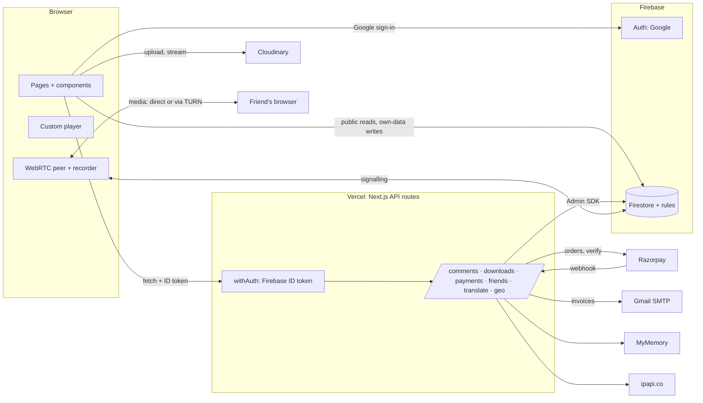
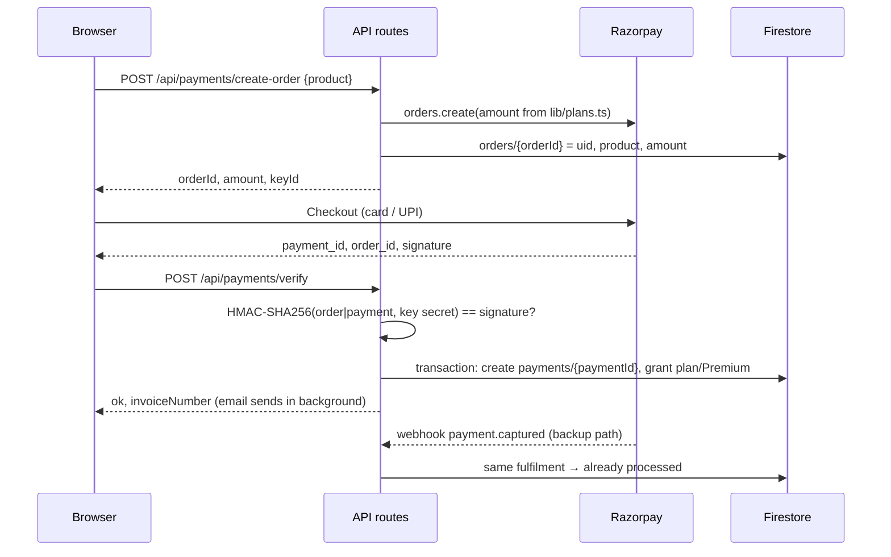
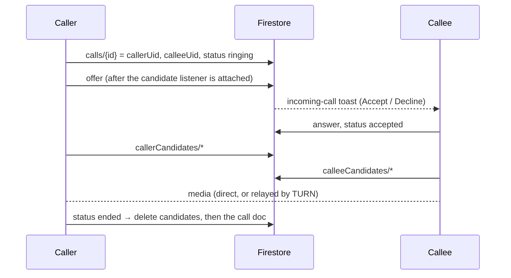

# YourTube: Project Guide

This guide explains how the whole project works: what each feature does, how the pieces fit together, why things are built the way they are, and how to test, deploy and troubleshoot it. For a quick start, see the [README](../README.md).

**Live site:** https://yourtube-nu.vercel.app

---

## Contents

1. [What the app is](#1-what-the-app-is)
2. [Tech stack](#2-tech-stack)
3. [Architecture](#3-architecture)
4. [Repository layout](#4-repository-layout)
5. [Data model (Firestore)](#5-data-model-firestore)
6. [Security model](#6-security-model)
7. [Cross-cutting building blocks](#7-cross-cutting-building-blocks)
8. [Features in depth](#8-features-in-depth)
   - [8.1 Sign-in](#81-sign-in)
   - [8.2 Theme by time and location](#82-theme-by-time-and-location)
   - [8.3 Comments](#83-comments)
   - [8.4 Downloads and Premium](#84-downloads-and-premium)
   - [8.5 Plans and watch-time limits](#85-plans-and-watch-time-limits)
   - [8.6 Payments and invoices](#86-payments-and-invoices)
   - [8.7 Custom video player and gestures](#87-custom-video-player-and-gestures)
   - [8.8 Friends, video calls, screen share and recording](#88-friends-video-calls-screen-share-and-recording)
   - [8.9 Channels, uploads, search and lists](#89-channels-uploads-search-and-lists)
9. [API reference](#9-api-reference)
10. [Test overrides](#10-test-overrides)
11. [Testing](#11-testing)
12. [Configuration and environment variables](#12-configuration-and-environment-variables)
13. [Deployment and operations](#13-deployment-and-operations)
14. [Troubleshooting](#14-troubleshooting)
15. [Known limitations and trade-offs](#15-known-limitations-and-trade-offs)
16. [History of the project](#16-history-of-the-project)

---

## 1. What the app is

YourTube is a YouTube-style video site. Anyone can browse and watch videos; signed-in users can upload videos to their channel, comment, like, keep a watch history and watch-later list, download videos, buy plans, and make video calls with friends.

On top of the basic clone, six features were built:

| # | Feature | One-line summary |
|---|---|---|
| 1 | **Comments** | Special-character filter, commenter's city, like/dislike with auto-removal at 2 dislikes, translation into 15 languages |
| 2 | **Downloads** | 1 free download per IST day; ₹99 Premium for unlimited; a Downloads page |
| 3 | **Plans** | Free/Bronze/Silver/Gold per-video watch limits, paid via Razorpay, with emailed PDF invoices |
| 4 | **Theme** | Light theme only 10:00–12:00 IST in five southern states (the OTP sign-in step was later removed; see [§8.1](#81-sign-in)) |
| 5 | **Gesture player** | Custom player with tap zones: double-tap to seek, triple-tap for next video / comments / close |
| 6 | **Calls** | Friends list, peer-to-peer video calls, screen share, and recording saved to your device |

---

## 2. Tech stack

| Layer | Technology | Why |
|---|---|---|
| Framework | **Next.js 15 (Pages Router)**, React 19, TypeScript | Pages and API routes in one app, deployed as serverless functions |
| UI | Tailwind CSS v4, shadcn/ui (Radix), lucide icons, `sonner` toasts, `next-themes` | Consistent components with light/dark theme tokens |
| Auth | **Firebase Authentication** (Google sign-in) | Hosted identity with ID tokens the server can verify |
| Database | **Cloud Firestore** + security rules | Real-time listeners (comments, friends, calls) and per-document rules |
| Server | Next.js API routes + **Firebase Admin SDK** (13.x) | Trusted code for money, limits and moderation |
| Video storage | **Cloudinary** (unsigned upload preset) | Direct browser upload, CDN delivery, URL transforms for downloads/thumbnails |
| Payments | **Razorpay** (test mode) | Indian payments (cards, UPI) with order + signature verification |
| Email | **Nodemailer** + Gmail SMTP (App Password), **pdfkit** for invoices | No paid provider needed |
| Translation | **MyMemory** API | Free, no key required |
| Location | Vercel IP headers, **ipapi.co** fallback | Region decides theme and comment city |
| Calls | **WebRTC**, Firestore for signalling, Metered **TURN** | Peer-to-peer media; no websocket server needed |
| Hosting | **Vercel** | Native Next.js hosting, IP geolocation headers, `waitUntil` |
| Tests | **Vitest**, Firebase **emulators**, `@firebase/rules-unit-testing`, **Playwright** | Unit, rules, API, multi-user browser and smoke tests |

---

## 3. Architecture



### The core rule: trust nothing from the browser that matters

The browser talks to Firestore directly for **public reads** (videos, comments, channels) and for **low-stakes data it owns** (likes, history, watch later, presence, call signalling). Everything that involves **money, limits or moderation** goes through an API route:

- plan, Premium flag, payments and invoices
- download quota
- comments (text validation, city, reactions, removal at 2 dislikes)
- friendships (two-sided writes)

The API routes use the **Firebase Admin SDK**, which bypasses the security rules, and the rules forbid the browser from writing those same fields. So a user editing requests in DevTools can't grant themselves Gold, reset their download count or resurrect a removed comment.

### Request lifecycle for a protected API call

1. The browser calls `apiFetch()` (`src/lib/apiClient.ts`), which attaches `Authorization: Bearer <Firebase ID token>` and any test-override headers.
2. The route is wrapped in `withAuth([...methods], handler)` (`src/lib/server/withAuth.ts`):
   - rejects the wrong HTTP method with **405**
   - verifies the ID token with `adminAuth().verifyIdToken` → **401** if missing/invalid
3. The handler runs. Throwing `HttpError(status, body)` sends that JSON; any other error becomes a logged **500** with a generic message.

---

## 4. Repository layout

```
/
├── README.md                     quick start
├── docs/PROJECT_GUIDE.md         this document
├── firestore.rules               security rules (deployed with the Firebase CLI)
├── firestore.indexes.json        composite indexes
├── firebase.json, .firebaserc    Firebase CLI config (project yourtube-6351d, emulator ports)
├── .vercelignore                 what `vercel deploy` uploads
└── yourtube/                     the Next.js app (Vercel project root)
    ├── next.config.ts            pdfkit external, font tracing, /__/auth rewrite, emulator flag pin
    ├── .env.example              every environment variable, documented
    ├── assets/fonts/             Noto Sans (₹ glyph for PDF invoices) + OFL licence
    ├── src/
    │   ├── pages/                routes (index, watch/[id], channel/[id], plans, downloads, call, …)
    │   ├── pages/api/            server routes (see §9)
    │   ├── components/           UI: player, comments, dialogs, call room, …
    │   ├── components/ui/        shadcn/ui primitives
    │   ├── components/call/      FriendsPanel, CallRoom, IncomingCallListener, PresenceHeartbeat
    │   ├── lib/                  browser services + pure logic (shared with the server where safe)
    │   ├── lib/server/           server-only: Admin SDK, withAuth, geo, payments, mailer, invoice
    │   └── styles/globals.css    theme tokens (light/dark), player animations
    ├── tests/rules/              Firestore rules tests
    ├── tests/api/                API tests over HTTP against the emulators
    ├── tests/e2e/                two-browser call/friends tests against the emulators
    └── tests/smoke/              Playwright smoke test (local build or a deployment)
```

### Pure logic modules (unit-tested)

| Module | Responsibility |
|---|---|
| `lib/ist.ts` | IST parts, start/end of the IST day, `INV` date stamps, formatting |
| `lib/commentText.ts` | Comment normalisation + the special-character rule |
| `lib/commentReactions.ts` | Like/dislike state transitions, removal threshold |
| `lib/plans.ts` | Plans, prices, watch limits, `canUpgrade`, `getProduct` |
| `lib/downloadQuota.ts` | Day key and quota maths |
| `lib/cloudinary.ts` | `fl_attachment` download URLs, thumbnail URLs |
| `lib/watchLimit.ts` | Playback budget accounting, seek clamping |
| `lib/theme.ts` | The light/dark rule |
| `lib/regions.ts` | Indian state codes, southern-state check |
| `lib/gestures.ts` | Tap zones, `resolveGesture`, the 300 ms tap resolver |
| `lib/callRecorder.ts` | Recording filename, MIME selection (plus the recorder itself) |
| `lib/server/razorpay.ts` | Payment and webhook signature checks |
| `lib/server/translate.ts` | Chunking text for MyMemory's 500-byte limit |
| `lib/server/invoice.ts` | Invoice PDF / HTML / text rendering |

---

## 5. Data model (Firestore)

| Path | Written by | Read by | Fields |
|---|---|---|---|
| `users/{uid}` | browser (profile fields only), server | owner only | `email, name, channelname, description, image, joinedon`; server-only: `plan, planUpdatedAt, isPremium, premiumSince` |
| `users/{uid}/downloads/{id}` | server | owner | `videoId, videotitle, videoUrl, thumbnail, downloadedAt` |
| `users/{uid}/downloadDays/{YYYYMMDD}` | server | nobody | `count, day`: the per-IST-day download counter |
| `users/{uid}/friends/{friendUid}` | server | owner | `status: incoming\|outgoing\|accepted, name, email, image, since` |
| `channels/{uid}` | owner, server | everyone | `channelname, description, name, image`: public channel card |
| `videos/{id}` | uploader | everyone | `videotitle, filename, filetype, videoUrl, filesize, videochanel, likes, views, uploader, createdAt` |
| `comments/{id}` | server | everyone | `videoid, userid, commentbody, usercommented, userimage, city, likes[], dislikes[], edited, commentedon` |
| `likes/{id}`, `history/{id}`, `watchlater/{id}` | owner | owner | `viewer, videoid, likedon/timestamp` |
| `orders/{razorpayOrderId}` | server | nobody | `uid, product, amount, currency, status, createdAt, paymentId` |
| `payments/{razorpayPaymentId}` | server | owner | `uid, orderId, paymentId, product, productName, amount, currency, invoiceNumber, source, emailStatus, emailError, testMode, createdAt` |
| `presence/{uid}` | owner | signed-in users | `lastSeen` |
| `calls/{id}` | participants | participants | `callerUid, calleeUid, callerName, calleeName, status, offer, answer, createdAt` |
| `calls/{id}/callerCandidates`, `/calleeCandidates` | participants | participants | ICE candidate JSON |

**Why `users` is private and `channels` is public:** profiles hold email and plan. Channel pages only need the name, description and avatar, so those are copied to `channels/{uid}`. The copy is written when the account is first created and rewritten whenever the user edits their channel.

**Composite indexes** (`firestore.indexes.json`): comments by `videoid` + `commentedon desc`; payments by `uid` + `createdAt desc`; calls by `calleeUid` + `status` + `createdAt desc`.

---

## 6. Security model

### Layers

1. **Firebase ID tokens:** every protected API route verifies the caller's token server-side.
2. **Firestore rules** (`firestore.rules`):
   - public read: `videos`, `comments`, `channels`
   - owner-only read: `users/{uid}` and its subcollections, `payments` (own)
   - no browser writes at all: `comments`, `payments`, `orders`, `downloads`, `downloadDays`, `friends`
   - `users/{uid}` updates may only touch `name, channelname, description, image`
   - `videos`: create only as yourself with `likes == 0 && views == 0`; `views` may only go up by exactly 1; `likes` by ±1
   - `calls`: only participants can read/update/delete; you can only create a call to an **accepted friend**; candidates are readable/writable by participants only
3. **Money comes only from server config:** routes accept a product id, never an amount. `create-order` reads `lib/plans.ts`; fulfilment copies the amount from the stored order; the webhook rejects a captured amount that doesn't match.
4. **Secrets stay on the server:** only `NEXT_PUBLIC_*` values reach the browser. A build-time scan confirmed the Razorpay secret, SMTP password, Firebase private key and service-account email are absent from the client bundle.

### What was checked (Phase 7)

- every route that touches money, limits or other users' data is wrapped in `withAuth`
- `/api/geo` and `/api/translate` are intentionally public; the webhook is authenticated by its HMAC signature
- 16 rules tests run against the emulator

---

## 7. Cross-cutting building blocks

### IST time (`lib/ist.ts`)

All time rules use **Asia/Kolkata** through `Intl.DateTimeFormat`, never the browser's or server's local zone. IST has no daylight saving, so the start of an IST day is `Date.UTC(y, m-1, d) − 5h30m`. Used by: the theme rule, the download day key, invoice numbers and timestamps, and recording filenames. The theme tests pass even with the machine's time zone set to Los Angeles.

### Location (`lib/server/geo.ts`, `GET /api/geo`)

Order of precedence:
1. **Test override** (`x-test-region` header or `?testRegion=`), only when `NEXT_PUBLIC_ENABLE_TEST_OVERRIDES=true`
2. **Vercel headers:** `x-vercel-ip-country`, `x-vercel-ip-country-region`, `x-vercel-ip-city` (URL-decoded)
3. **ipapi.co** (local development): looked up for the client's public IP, or the server's own IP when the client IP is private; cached per IP for 30 minutes

The result is `{ city, regionCode, regionName, country, source }`. Region codes are ISO 3166-2:IN without the `IN-` prefix (`MH`, `KL`, …). Unknown location is treated as "not southern" everywhere.

### Error handling

- server: `HttpError(status, { error, reason, ... })` for expected failures; `reason` is a stable machine-readable code (`UNAUTHENTICATED`, `DAILY_LIMIT`, `SPECIAL_CHARS`, `NOT_AN_UPGRADE`, …)
- client: `apiFetch` throws `ApiError` with `.status` and `.reason`, and components branch on the reason (e.g. `DAILY_LIMIT` opens the Premium dialog); other errors become toasts

### UI events

Two small window events decouple components:
- `yourtube:open-comments`: the player's left triple-tap → Comments scrolls/opens and focuses the input
- `yourtube:toggle-sidebar`: the header ☰ button → the sidebar drawer on phones

---

## 8. Features in depth

### 8.1 Sign-in

Sign-in is plain **Google sign-in** with no second step: no OTP, phone number or email code. Once Firebase reports a signed-in user, `AuthContext` loads (or creates) their profile and they're logged in. A new account also gets its public `channels/{uid}` card at this point.

- **Server checks:** `withAuth` only verifies the Firebase ID token. The Firestore rules only require `request.auth` (plus the usual ownership checks).
- **Redirect sign-in on a custom domain:** browsers partition third-party storage, which breaks `signInWithRedirect` when the auth domain differs from the site. `next.config.ts` rewrites `/__/auth/*` to `yourtube-6351d.firebaseapp.com`, and production sets `NEXT_PUBLIC_FIREBASE_AUTH_DOMAIN=yourtube-nu.vercel.app`.
- **Sign-in errors** (e.g. `auth/unauthorized-domain`) are shown as toasts with the fix.

Files: `lib/AuthContext.tsx`, `lib/firebase.js`, `lib/server/withAuth.ts`.

### 8.2 Theme by time and location

Rule (`lib/theme.ts`): **light** when the IST hour is 10 or 11 **and** the region is TN, KL, KA, AP or TG (legacy TS accepted) **in India**; **dark** in every other case, including unknown location.

`components/ThemeController.tsx` looks up the location on load and again when someone signs in, applies the rule through `next-themes` (`attribute="class"`, OS preference ignored), and re-checks on every minute boundary so the theme flips exactly at 10:00 and 12:00. Every component uses theme tokens (`bg-background`, `text-muted-foreground`, …) rather than fixed light colours.

### 8.3 Comments

- **Posting** (`POST /api/comments`): the server normalises the text (NFC; curly quotes and dashes → ASCII), validates it, looks up the commenter's **city** itself, and writes the comment. The browser shows a toast for invalid text before sending, but the server is what enforces it.
- **Allowed characters:** letters and combining marks in any script (`\p{L}\p{M}`), digits (`\p{N}`), whitespace, `. , ! ? ' " - ( ) :`, plus ZWNJ/ZWJ (Indic conjuncts) and the Devanagari danda `।` / `॥`. Everything else (e.g. `@ # $ % ^ & * < > { } [ ] / \ | ~ \` = + _ ;` and emoji) is rejected with `400 SPECIAL_CHARS` listing the offending characters. Maximum 1000 characters.
- **Edits and deletes** go through `PATCH/DELETE /api/comments/[id]`: owner only, same text rule.
- **Reactions** (`POST /api/comments/[id]/react`) run in a **Firestore transaction**: like and dislike are mutually exclusive, choosing the same one again removes it, you can't react to your own comment, and at **2 dislikes the comment is deleted in the same transaction** (`{ removed: true }`). A test fires two dislikes at the same moment and checks the comment is removed exactly once.
- **Translation:** a Translate button plus a menu of 15 languages (English, Hindi, Marathi, Tamil, Telugu, Kannada, Malayalam, Bengali, Gujarati, Punjabi, Urdu, Spanish, French, German, Japanese). The last choice is remembered in `localStorage`; results are cached per text + language; "Show original" hides the translation. The server calls MyMemory with `langpair=autodetect|<target>` (MyMemory rejects `auto`), splits long text into ≤ 480-byte chunks (Indic scripts are 3 bytes per character), and returns the original text when MyMemory says source and target are the same language. The provider sits behind a `Translator` interface so it can be swapped for Google Cloud Translate.
- **Display:** "Name · City · 2h ago (edited)". On phones the section collapses to a summary that opens as a bottom sheet.

### 8.4 Downloads and Premium

- `POST /api/downloads { videoId }`:
  - **Free: 1 download per IST calendar day.** A counter at `users/{uid}/downloadDays/{YYYYMMDD}` is read and incremented **in the same transaction** as the download record, so parallel clicks can't both use the free download (tested with four simultaneous clicks).
  - Re-downloading a video that's already in your Downloads doesn't count.
  - **Premium:** unlimited.
  - Over quota → `402 { reason: "DAILY_LIMIT" }` → the Go Premium dialog opens.
  - Success returns a Cloudinary URL with `fl_attachment:<safe-title>` inserted, so the browser saves the file instead of playing it (the HTML `download` attribute doesn't work across origins).
- `GET /api/downloads` returns the list and the quota: `"0 of 1 left today"` or `"Unlimited · Premium"`, plus when it resets (next IST midnight).
- **`/downloads` page:** thumbnail (a Cloudinary frame at 1 s), title, date and a Play link to the watch page. Linked from the sidebar, the account menu and your channel page.
- **Premium** costs **₹99** (one-time) and is separate from the watch-time plans. The header shows a Premium badge.

### 8.5 Plans and watch-time limits

| Plan | Price | Watch time per video |
|---|---|---|
| Free | ₹0 | 5 minutes |
| Bronze | ₹10 | 7 minutes |
| Silver | ₹50 | 10 minutes |
| Gold | ₹100 | unlimited |

- **How the limit works** (`lib/watchLimit.ts`, `lib/useWatchLimit.ts`): each time a video is opened the viewer gets their plan's budget of *played* time. Normal `timeupdate` ticks (≤ 2.5 s apart) add to the played time; bigger jumps count as seeks and add nothing. Seeks are clamped to just below the limit position, so skipping ahead can't be used to watch past it. At the limit the video pauses, controls disappear and the overlay says *"Your Free plan allows 5 minutes per video. Upgrade to keep watching"* with a link to `/plans`. A chip shows the time left; the seek bar marks where the limit is. Logged-out viewers get the Free limit. Upgrading mid-video raises the limit without resetting what was watched.
- **`/plans` page:** four cards, the current plan highlighted, equal and lower plans disabled (upgrade only; the server enforces this with `409 NOT_AN_UPGRADE`), plus your payment history with **Resend invoice** for failed emails.

### 8.6 Payments and invoices



- **Fulfilment is idempotent** (`lib/server/payments.ts`): verify and the webhook both call `fulfilPayment`, which creates `payments/{paymentId}` in a transaction. Whichever arrives first grants the entitlement; the other sees the document and does nothing. It also checks the order belongs to the caller (verify), that the captured amount matches (webhook), and never downgrades a plan (e.g. a late Bronze webhook after a Gold purchase).
- **Webhook** (`/api/payments/webhook`): reads the raw body, checks `X-Razorpay-Signature` with `RAZORPAY_WEBHOOK_SECRET`, handles `payment.captured`, acknowledges unknown orders with 200 so Razorpay stops retrying, and returns 5xx on temporary failures so Razorpay retries.
- **Invoice email** (`lib/server/invoice.ts`), for plan upgrades and Premium:
  - invoice number `INV-YYYYMMDD-XXXXXX` (IST date + end of the payment id)
  - IST date/time, name, email, plan, amount in ₹, what's included, Razorpay order and payment IDs, and a **TEST MODE** marker
  - HTML body, plain-text fallback, and a **PDF attachment** from pdfkit using embedded Noto Sans (pdfkit's built-in fonts have no ₹ glyph)
  - sent through `lib/server/mailer.ts` (Gmail SMTP; swappable for Resend)
  - sent **in the background** with Vercel's `waitUntil`, because Gmail takes several seconds and Razorpay webhooks time out at about 5 s
  - a failed email never fails the payment: `payments/{id}.emailStatus = "failed"` and the plans page shows **Resend invoice**
- **Test mode:** card `4111 1111 1111 1111` (any future expiry, any CVV), UPI `success@razorpay`.

### 8.7 Custom video player and gestures

`components/Videopplayer.tsx` hides the native controls and draws its own bar: play/pause, seek (with the plan-limit marker), mute + volume, time, a speed menu (0.5×–2×; rendered inline so it still shows in fullscreen) and fullscreen (iOS falls back to the video element's own fullscreen). The bar auto-hides after 3 s of playback.

A transparent layer over the video handles **touch and mouse** through pointer events. It's split into **left 30% / centre 40% / right 30%**. Taps are counted until **300 ms** pass without another tap (`createTapResolver`); a tap in a different zone ends the current sequence. Then `resolveGesture(zone, count)` decides:

| Zone | 1 tap | 2 taps | 3 taps |
|---|---|---|---|
| Left | show/hide controls | back 10 s, "« 10s" ripple | open comments (scroll + focus; bottom sheet on phones) |
| Centre | play/pause, icon flash | nothing | next video (first of the Related list) |
| Right | show/hide controls | forward 10 s, "» 10s" ripple | close the site |

**Closing the site:** browsers only let `window.close()` close tabs a script opened. The player pauses, tries `window.close()`, and if the tab is still open after 300 ms shows a full-screen **Session ended** screen with a **Go back** button.

**Keyboard:** Space/K play-pause, J/L back/forward 10 s, F fullscreen (ignored while typing in a field).

All seeks (gestures, keys, seek bar) respect the watch limit.

### 8.8 Friends, video calls, screen share and recording

**Friends** (`/call`): add by the email someone signs in with. The server writes both sides (`outgoing` for you, `incoming` for them); if they had already asked you, adding them back accepts. Accept/decline, cancel and unfriend all update both sides. The list is live (Firestore listener). Online dots come from `presence/{uid}.lastSeen`, written every 45 s while the tab is visible; "online" means under 2 minutes old.

**Calls** follow the Firebase WebRTC codelab pattern:



- `/call?to=<friendUid>` rings; `/call?id=<callId>` answers.
- ICE servers: Google STUN plus the Metered TURN servers from `NEXT_PUBLIC_TURN_*` (UDP 80, TCP 80, UDP 443 and TLS 443, so calls get through mobile networks and CGNAT).
- Controls: mute, camera on/off, share screen, record, hang up, and a timer that starts when the connection is established.
- Unanswered calls end after 45 s. Hang-up, decline, missed calls and closing the tab all mark the call and delete its documents (candidates first, because the rules read the parent document).
- Without a camera, the call continues audio-only (a video slot is still negotiated so screen share can use it).
- The rules only let you ring an **accepted friend**.

**Screen share:** `getDisplayMedia` with hints (`displaySurface: "browser"`, `preferCurrentTab: false`, `selfBrowserSurface: "exclude"`, `surfaceSwitching: "include"`), then `replaceTrack` on the video sender, so no renegotiation is needed. If the user ticks *Share tab audio*, the tab audio is mixed with the microphone and sent together. When sharing stops (button or the browser's own "Stop sharing"), the camera track goes back. The other person is told via the data channel, and the UI hints *"Pick the YouTube tab to watch together"*.

**Recording** (`lib/callRecorder.ts`):
- videos are drawn onto a 1280×720 `<canvas>` at 30 fps: side by side normally, or the shared screen full size with the cameras as picture-in-picture
- the draw loop runs on a **Web Worker timer**, because `requestAnimationFrame` stops in background tabs, which is exactly when you're looking at the tab you're sharing
- both audio tracks (plus shared-tab audio, even if sharing starts mid-recording) are mixed through an `AudioContext` into one track
- `MediaRecorder` uses `video/webm;codecs=vp9,opus`, falling back to vp8, then plain webm
- on **Stop**, the save dialog (`showSaveFilePicker`) opens straight away, while the click still counts as a user gesture; where it isn't supported (Firefox, Safari) the file downloads instead. If the call ends mid-recording, it downloads automatically
- the file is named `yourtube-call-YYYYMMDD-HHmm.webm` (IST)
- both people see a red **REC** badge, sent over a WebRTC **data channel**

### 8.9 Channels, uploads, search and lists

- **Channel:** created from the sidebar or account menu; stored on the private profile and published to `channels/{uid}`. The owner's channel page shows the uploader and a link to their downloads.
- **Upload:** directly from the browser to Cloudinary with the unsigned preset (with a progress bar), then a `videos` document is created (signed-in users only, only as yourself).
- **Search:** filters the videos by title or channel name (case-insensitive). Firestore has no substring search, and the catalogue is small, so it filters in the browser.
- **History, Liked videos, Watch later:** one shared `VideoList` component with per-page loaders.
- **Home:** video cards with real durations; an empty state when there are no videos.
- **Phones:** the sidebar becomes a drawer behind the ☰ button; the header drops non-essential icons.

---

## 9. API reference

All request and response bodies are JSON. "Auth" means `Authorization: Bearer <Firebase ID token>` (otherwise `401 { reason: "UNAUTHENTICATED" }`).

| Route | Method | Guard | Request | Success response | Notable errors |
|---|---|---|---|---|---|
| `/api/geo` | GET | public | — | `{ city, regionCode, regionName, country, source }` | — |
| `/api/translate` | POST | public | `{ text, target }` | `{ translatedText, detectedSource }` | 400 unsupported language, 502 provider down |
| `/api/comments` | POST | Auth | `{ videoId, text }` | 201 `{ comment }` | 400 `SPECIAL_CHARS` / `EMPTY` / `TOO_LONG`, 404 video |
| `/api/comments/[id]` | PATCH | Auth | `{ text }` | `{ comment }` | 403 not owner, 400 text rule |
| `/api/comments/[id]` | DELETE | Auth | — | `{ deleted: true }` | 403 not owner |
| `/api/comments/[id]/react` | POST | Auth | `{ type: "like" \| "dislike" }` | `{ removed: false, likes, dislikes }` or `{ removed: true }` | 400 own comment, 404 `GONE` |
| `/api/downloads` | GET | Auth | — | `{ downloads[], quota }` | — |
| `/api/downloads` | POST | Auth | `{ videoId }` | `{ url, quota }` | 402 `DAILY_LIMIT`, 404 video |
| `/api/payments/create-order` | POST | Auth | `{ product: premium\|bronze\|silver\|gold }` | `{ orderId, amount, currency, keyId, productName, prefill }` | 400 unknown product, 409 already Premium / `NOT_AN_UPGRADE` |
| `/api/payments/verify` | POST | Auth | `{ razorpay_order_id, razorpay_payment_id, razorpay_signature }` | `{ ok, alreadyProcessed, product, invoiceNumber, emailStatus }` | 400 `BAD_SIGNATURE`, 403 someone else's order |
| `/api/payments/webhook` | POST | HMAC signature | Razorpay event (raw body) | `{ ok, alreadyProcessed }` or `{ ignored }` | 400 bad signature, 500 temporary (Razorpay retries) |
| `/api/payments/resend-invoice` | POST | Auth | `{ paymentId }` | `{ emailStatus: "sent" }` | 404, 409 `ALREADY_SENT`, 502 send failed |
| `/api/friends/request` | POST | Auth | `{ email }` | `{ uid, status: outgoing\|accepted }` | 404 no such account, 400 yourself, 409 already friends / sent |
| `/api/friends/respond` | POST | Auth | `{ uid, accept }` | `{ status: accepted\|declined }` | 404 no pending request |
| `/api/friends/[uid]` | DELETE | Auth | — | `{ removed: true }` | — |

Common to all: 405 for the wrong method; 401 for a missing or invalid token; 500 with a generic message for unexpected errors (details are logged on the server).

---

## 10. Test overrides

Enabled only when `NEXT_PUBLIC_ENABLE_TEST_OVERRIDES=true` (it is **on** in production for demos). While any override is active, a purple **TEST OVERRIDE** badge is shown at the bottom-left. Overrides are remembered for the tab; `?testReset=1` clears them.

| Parameter | Effect |
|---|---|
| `?testRegion=KL` | Pretend to be in that Indian state: theme and comment city. The browser sends it to the server as the `x-test-region` header. |
| `?testHour=11` | Pretend the IST hour is 11: theme only. |
| `?testWatchLimit=20` | Shorten a limited plan's watch budget to 20 s (5–3600) to demo the lock on short clips. Never lifts Gold's unlimited. |

Example: `https://yourtube-nu.vercel.app/?testRegion=KL&testHour=11` gives the light theme.

> ⚠️ While the flag is on, anyone can fake their region. Turn it off in Vercel when you're not demoing.

---

## 11. Testing

| Command (in `yourtube/`) | What it runs | Needs |
|---|---|---|
| `npm test` | **159 unit tests** (Vitest) for all the pure modules in §4 | nothing |
| `npm run test:rules` | **16 Firestore rules tests** | Java (Firestore emulator) |
| `npm run test:api` | **26 API tests** over HTTP: `next dev` against the Auth + Firestore emulators, real Razorpay **test** orders, captured (not sent) emails | Java, Razorpay test keys in `.env.local` |
| `npm run test:e2e` | **5 two-browser tests**: friend request/accept + online, ring/accept/video both ways, recording indicator + valid `.webm`, hang-up cleanup, decline, not-a-friend rule, screen share | Java, Playwright Chromium (fake camera) |
| `npm run test:smoke` | **8 smoke checks** (desktop + phone) on a local production build, or a deployment with `SMOKE_URL=https://…` | at least one video in Firestore |
| `npm run lint`, `npm run typecheck` | ESLint (Next + TypeScript rules), `tsc --noEmit` | — |

How the harder parts are tested:

- **Emails in tests** are written to disk (`MAIL_CAPTURE_DIR`) so tests can open the invoice PDF.
- **The browser app against the emulators:** building with `NEXT_PUBLIC_USE_EMULATORS=true` connects the client SDK to the emulators and adds a test-only email/password sign-in hook. The flag is pinned at build time in `next.config.ts`, so normal builds compile this code out completely.
- **Payments** use real Razorpay test orders; the payment step is simulated by signing a fake payment id with the test secret, which exercises the same verification code.

---

## 12. Configuration and environment variables

Every variable is documented in [`yourtube/.env.example`](../yourtube/.env.example). Key points:

- `NEXT_PUBLIC_*` values are inlined into the browser bundle at **build time**; they must never hold secrets, and changing one needs a rebuild.
- `FIREBASE_PRIVATE_KEY` is stored on one line with literal `\n`, wrapped in double quotes; the server converts them back.
- `NEXT_PUBLIC_FIREBASE_AUTH_DOMAIN` is the Vercel domain in production (for the `/__/auth` rewrite) and `yourtube-6351d.firebaseapp.com` elsewhere.
- `NEXT_PUBLIC_RAZORPAY_KEY_ID` isn't actually read; Checkout gets the key id from `create-order`.
- `MYMEMORY_EMAIL` is optional (raises MyMemory's free quota; the address is sent to MyMemory).
- Test-only, never set in a deployment: `NEXT_PUBLIC_USE_EMULATORS`, `MAIL_CAPTURE_DIR`.

External accounts used: Firebase project `yourtube-6351d` (Spark plan), Cloudinary cloud `dsdyrj0c9` (preset `yourtube`, unsigned), Razorpay (test mode), Gmail (App Password), Metered (TURN), Vercel (project `yourtube`).

---

## 13. Deployment and operations

### Vercel

- Project `yourtube`, root directory `yourtube/`, framework Next.js, **Node 24.x**, production domain **yourtube-nu.vercel.app**.
- **Not connected to GitHub:** merging to `main` doesn't deploy. Deploy from the repo root with:
  ```bash
  npx vercel@latest deploy --prod --yes
  ```
  `.vercelignore` keeps `node_modules`, build output, test artefacts and **all `.env*` files** out of the upload; environment variables come from the Vercel project (Production and Preview).
- Useful: `npx vercel@latest logs https://yourtube-nu.vercel.app` for runtime errors, `npx vercel@latest env ls` for variables.

### Firebase

- Rules and indexes: `npx --prefix yourtube firebase deploy --only firestore` from the repo root.
- One-time console setup:
  - Authentication → Settings → **Authorized domains**: `yourtube-nu.vercel.app` (done)
  - Google Cloud → Credentials → Web OAuth client: JavaScript origin `https://yourtube-nu.vercel.app` and redirect URI `https://yourtube-nu.vercel.app/__/auth/handler` (done)

### Razorpay

- Webhook: URL `https://yourtube-nu.vercel.app/api/payments/webhook`, event `payment.captured`, secret = `RAZORPAY_WEBHOOK_SECRET` (in `yourtube/.env.local` and Vercel). Payments work without it; it's the backup for a closed tab.

### Version pins that matter

| Package | Pin | Reason |
|---|---|---|
| `next` | ≥ 15.5.27 | Vercel refuses to deploy vulnerable Next versions (15.3.3 was blocked) |
| `firebase-admin` | **13.x** | 14.x pulls `jwks-rsa` 4 → `jose` 6, which is ESM-only and loaded with `require()`. Vercel's function loader rejects that (`ERR_REQUIRE_ESM`), so every token check returned 500 |
| `@firebase/rules-unit-testing` | 4.x | 5.x needs the Firebase 12 client SDK |
| `pdfkit` | external package | it reads font metric files from its own folder at runtime |

---

## 14. Troubleshooting

| Symptom | Cause | Fix |
|---|---|---|
| Clicking **Sign in** shows "Sign-in isn't enabled for … yet" | `auth/unauthorized-domain` | Add the domain to Firebase → Authentication → Settings → Authorized domains |
| Google shows `redirect_uri_mismatch` | The OAuth client doesn't list `https://<domain>/__/auth/handler` | Add it in Google Cloud → Credentials |
| Protected APIs return 500 on Vercel | Check logs; the known cause was `firebase-admin` 14 (`ERR_REQUIRE_ESM`) | Keep `firebase-admin` on 13.x |
| Home page stuck on "Loading…" | A browser extension blocking Firestore's connection | Try an Incognito window |
| Video won't play; Cloudinary returns 404 `Resource not found` | The file was deleted from Cloudinary but its Firestore document remains | Restore it from Cloudinary's trash or delete the `videos` document |
| Payment succeeded but no invoice email | Gmail SMTP failed; the payment is kept | Use **Resend invoice** on `/plans` |
| Call stuck on "Connecting…" across networks | No TURN relay reachable | Check the `NEXT_PUBLIC_TURN_*` values; test from a network that allows port 443 |

---

## 15. Known limitations and trade-offs

- **Closing the website:** browsers block `window.close()` for tabs the user opened, so the fallback is a "Session ended" screen.
- **Choosing the tab to share:** a page can't pick it; the user chooses. The app only passes hints.
- **Saving recordings:** Chrome/Edge show a save dialog; Firefox/Safari download to the default folder.
- **Recording in the background:** the worker timer keeps drawing, but browsers still throttle hidden tabs somewhat, so the frame rate may dip.
- **Calls** need both people to have the site open; there are no push notifications.
- **Watch limit is per viewing:** reloading the page starts a new budget, as specified ("each time a user watches a video").
- **Download filenames** keep only Latin letters and digits; an all-Hindi title downloads as `video.mp4`.
- **Search** filters in the browser, which is fine for a small catalogue but won't scale.
- **Test overrides in production** let anyone fake their region while the flag is on.
- **`postcss` inside Next** has an advisory whose fix needs Next 16; it only runs at build time on the app's own CSS.
- Some legacy placeholders remain (e.g. "1.2M subscribers" on the video page, the Subscribe button is local-only, Explore and Subscriptions links have no pages).

---

## 16. History of the project

| Step | What happened |
|---|---|
| Original | An Express + MongoDB backend (`server/`) with a Next.js frontend |
| PR #1 | Migrated to Firebase (Auth + Firestore) and Cloudinary |
| July 2026 | A first attempt at the six features on the `piush` branch; never merged (it trusted the browser for OTP, quotas and invoices) |
| PR #2 (Sept 2026) | Rebuilt the features on `feature/internship-tasks` in phases, with server enforcement and tests; deployed to Vercel; merged into `main` |
| Oct 2026 | Removed the OTP sign-in step (email codes, SMS via Phone Auth, the mobile-number step); sign-in is plain Google again |

Phases of PR #2:

0. Cleanup: removed `server/`, moved Firebase config to environment variables, fixed the channel link
1. Comments
2. Downloads and Premium
3. Plans, watch limits and invoices
4. Theme and OTP
5. Gesture player (plus the phone layout)
6. Friends, calls, screen share and recording
7. Smoke test and security pass
8. Deployment, README
